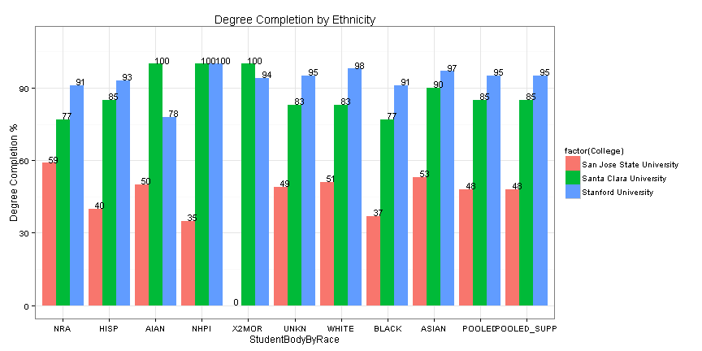

College Comparison for Prospective Students
========================================================
author: Tejash Panchal
date: January 24th, 2016

Problem Statement/Objective
========================================================

- For prospective students, selecting the right college can be challenging based on number of choices and various factors involved.
- Parents and students need an objective and systemetic way to evaluate colleges.
- The information students and parents receive directly from colleges, universities, and other sources is often sales oriented and therefore may not be objective.

Solution to students/parents question
========================================================

- This application attemts to provide students and parents with objective way to gather data on colleges and universities and a systemetic way to evaluate choices.
- This application also allows students and parents to perform comparison between maximum of three universities, or between three community colleges, or between universities and community colleges.

Sample cost comparison table
========================================================

- Table below shows the cost comparison between three colleges

|College.Name              | Academic.Year.Cost| In.State.Tuition| Out.of.State.Tuition|
|:-------------------------|------------------:|----------------:|--------------------:|
|San Jose State University |              21160|             7343|                18503|
|Santa Clara University    |              57213|            42156|                42156|
|Stanford University       |              58408|            43683|                43683|

Sample degree completion by Ethnicity Chart
========================================================

- Bar chart below also highlights direct correlation between Cost of a college and Graduation Rate.

